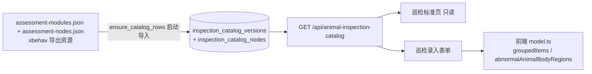

# Project Overview — 巡检标准在线编辑器

## Preliminary Direction

在「巡检标准」页为管理员提供在线编辑三个评估模块（基础评估、进阶评估、异常动物评估）内容的能力：新增/修改/删除条目、修改分类与描述、新增/替换参考图；保存为草稿、校验后发布为新 active 版本，历史版本保留，录入表单与标准页同源一致。

## Current Architecture

## Technology Stack

| Layer  | Current                                                   | Target                                    |
| :----- | :-------------------------------------------------------- | :---------------------------------------- |
| 语言   | Python 3.13 + TypeScript/React 19                         | 不变                                      |
| 后端   | 标准库 HTTP 服务（server.py/legacy.py + server_app 分层） | 不变，新增 animal_management 目录服务接口 |
| 前端   | Vite + antd 6 + TanStack Query                            | 不变，巡检标准页加编辑模式                |
| 数据库 | SQLite（版本化目录表已存在）                              | 不变                                      |
| 部署   | Docker（web-dist 静态 + Python 服务）                     | 不变，图片运行目录放 data volume          |

## Entry Points

- `GET /api/animal-inspection-catalog` — 当前 active 目录（登录可见）
- 前端 `巡检标准` 页面（animal-inspection-standards）、`动物巡检` 录入（animal-inspection-entry）

## Build & Run

`npm run dev`（Vite 5173 + API 5174）、`npm run check`、`npm run test:e2e`、`python3 -m unittest discover -s tests -p 'test_*.py'`

## External Integrations

参考图种子文件在 `server_app/resources/animal_inspection/v1/images/`，由受保护路由 `GET /api/animal-inspection-reference/{filename}` 提供；节点 `config.referenceImages` 引用它们。
