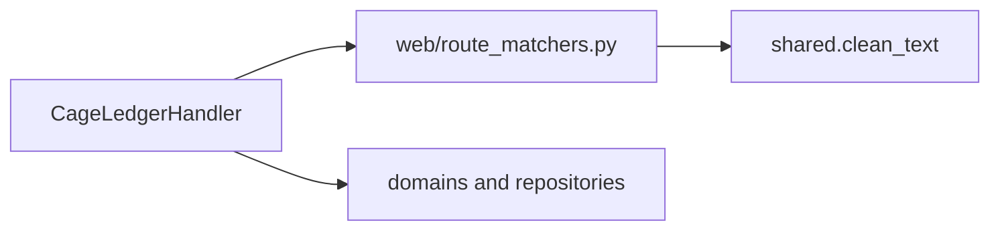

# legacy.py 路径匹配器拆分：项目概览

## 初步方向

从 `CageLedgerHandler` 提取纯路径与查询参数解析，形成 `server_app/web/route_matchers.py`；HTTP 分发顺序、鉴权、状态码和领域调用保留在 `legacy.py`。

## 当前边界

`legacy.py` 的 22 个 instance matcher 分布在约 6613–6843 行，接收 URL 路径并返回一个解码后的单段 ID 或 ID 元组。现有 `server_app/web/router.py` 负责 Regex HTTP 路由，`server_app/web/pdf_exports.py` 已有同类纯路径工具。

## 目标架构

新模块只处理路径、URL 解码和巡检附件的 `findingId` 查询参数，输入输出保持可序列化。

## 运行与验证

- `npm run check`
- `npm run smoke:api`
- 纯路径匹配单测与 API 契约回归
