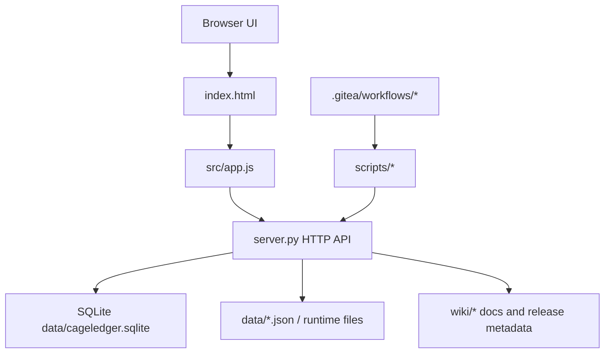

# Project Overview

## Preliminary Direction

在保留 CageLedger 当前技术栈和业务语义的前提下，先建立契约、边界、分阶段改造与进度控制体系，再逐步把单文件高耦合实现拆成可替换、可验证、可持续发布的结构。

## Current Architecture



当前架构是原生前端加 Python 标准库后端。`src/app.js` 负责页面状态、视图渲染、表单处理、接口调用和部分业务口径表达。`server.py` 负责 HTTP 路由、SQLite 持久化、权限、审计、导入索引、结算、流程和部分兼容迁移。发布、打包、索引构建、演示数据生成通过 `scripts/*` 和 `.gitea/workflows/*` 完成。

## Technology Stack

| Layer | Current | Target |
|:------|:--------|:-------|
| Language | JavaScript / Python | JavaScript / Python |
| Framework | Native DOM / Python stdlib HTTP | Native DOM with explicit modules / Python stdlib HTTP with layered services |
| Build Tool | none | none |
| Package Mgr | npm | npm |
| Database | SQLite | SQLite |
| Deployment | Docker Compose / Gitea / offline package | Docker Compose / Gitea / offline package |

## Entry Points

- Web UI: `index.html`
- Frontend runtime: `src/app.js`
- Backend server: `server.py`
- Shared mode start: `npm run dev`
- Static preview start: `npm run static`
- Syntax check: `npm run check`
- Offline package: `npm run package:offline`
- Local release: `npm run release:local -- --version X.Y.Z --push`
- Core API families:
  - `/api/auth/*`
  - `/api/bootstrap`
  - `/api/infrastructure*`
  - `/api/intake-batches*`
  - `/api/placement-tasks*`
  - `/api/quantity-sheets*`
  - `/api/billing-*`
  - `/api/system/*`

## Build & Run

### Shared mode

```bash
npm run dev
```

默认访问地址：

```text
http://localhost:5173
```

### Static mode

```bash
npm run static
```

### Validation

```bash
npm run check
```

### Packaging and release

```bash
npm run package:offline
npm run release:local -- --version X.Y.Z --push
```

## External Integrations

- SQLite database: `data/cageledger.sqlite`
- IACUC CSV / legacy XLSX import chain
- Gitea repository: `https://git.cellnucle.us/hugo/cageledger`
- Gitea Releases and Container Registry
- Docker / Docker Compose deployment targets
- Local runtime files under `data/`
