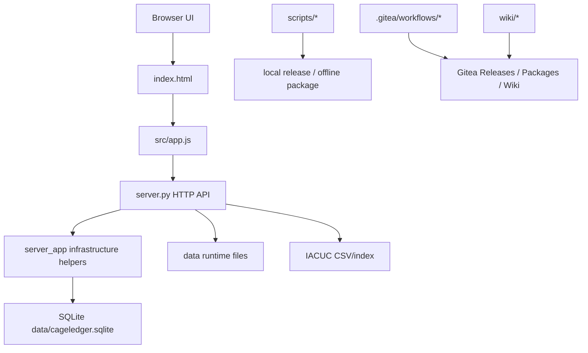

# Project Overview

## Direction

CageLedger 的规范化方向是保留当前原生前端、Python 标准库后端、SQLite、Gitea 发布链和 Wiki 体系，在此基础上建立显式契约、模块边界、迁移顺序和可续接进度控制。当前基线版本为 `0.5.2c`。

## Current Architecture

当前架构已支撑笼位、笼卡、待进驻、数量统计表、结算流程、系统更新、Gitea Release、Gitea Container Registry 和 Wiki 同步。主要复杂度集中在两个超大入口：`src/app.js` 承担前端状态、视图、交互、接口调用、打印导出和业务辅助逻辑；`server.py` 承担 HTTP 路由、SQLite schema/migration、权限、审计、结算、待进驻和更新检查。Phase 2 已开始把配置、连接、缓存和响应辅助迁移到 `server_app/`。

## Technology Stack

| Layer | Current | Target |
|:------|:--------|:-------|
| Frontend | Native HTML/CSS/JavaScript | Native JS with explicit `api/state/domain/views` modules |
| Backend | Python stdlib HTTP server | Python stdlib with `http/services/repositories/contracts` layers |
| Storage | SQLite + runtime JSON/CSV files | SQLite + explicit repository helpers |
| Packaging | npm scripts + shell/Python helpers | existing scripts with documented I/O contracts |
| Deployment | Docker Compose, Gitea Actions, offline package | same stack with release/package/wiki contracts |
| Documentation | `wiki/` + spec docs under `docs/` | `wiki/` for user/ops, `docs/` for spec-driven execution |

## Entry Points

| Purpose | Entry |
|:--------|:------|
| Web UI | `index.html` |
| Frontend runtime | `src/app.js` |
| Styling | `src/styles.css` |
| Backend server | `server.py` |
| Shared mode | `npm run dev` |
| Static mode | `npm run static` |
| Validation | `npm run check` |
| Offline package | `npm run package:offline` |
| Local release | `npm run release:local -- --version X.Y.Z --push` |

## Core Business Domains

| Domain | Current Files | Notes |
|:-------|:--------------|:------|
| Infrastructure | `src/app.js`, `server.py` | rooms/racks/slots/occupancies, summary/room/full bootstrap scopes |
| Intake cards | `src/app.js`, `server.py` | unprinted/printed/received batches, parsing, printing, receipt confirmation |
| Placement tasks | `src/app.js`, `server.py` | pending/reserved/active task flow linked to cage slots |
| Quantity sheets | `src/app.js`, `server.py` | paged sheets, transfer mirror sync, local merge responses |
| Billing workflows | `src/app.js`, `server.py` | statement generation, versions, events, workflow center |
| System/update | `src/app.js`, `server.py`, `.gitea/workflows/*` | Gitea latest Release is the update source |
| Wiki/docs | `wiki/*`, `docs/*` | `wiki/` is public documentation, `docs/` is spec-driven execution control |

## Core API Families

- `/api/auth/*`
- `/api/bootstrap`
- `/api/infrastructure*`
- `/api/intake-batches*`
- `/api/placement-tasks*`
- `/api/quantity-sheets*`
- `/api/billing-statements*`
- `/api/billing-workflows*`
- `/api/iacuc-index*`
- `/api/system/*`

Detailed API shape is defined in [API Contracts](../contracts/api-contracts.md). Frontend state boundaries are defined in [Frontend State Contract](../contracts/frontend-state.md). Migration boundaries are defined in [Module Boundaries](../contracts/module-boundaries.md).

## External Integrations

| Integration | Contract |
|:------------|:---------|
| Gitea repository | `https://git.cellnucle.us/hugo/cageledger` |
| Gitea Release | formal update source for installed systems |
| Gitea Container Registry | `git.cellnucle.us/hugo/cageledger:<tag>` |
| Gitea Wiki | synchronized from `wiki/**` on `main` |
| Docker Compose | online image deployment and offline source-build deployment |
| IACUC CSV | imported into SQLite and runtime index payload |

## Operating Constraints

- `wiki/` serves users, admins, and operators.
- `docs/` serves spec-driven architecture work and progress continuity.
- `data/` and generated runtime files stay outside routine code changes.
- Any interface, data structure, deployment, or user-operation change also updates the matching Wiki page.
