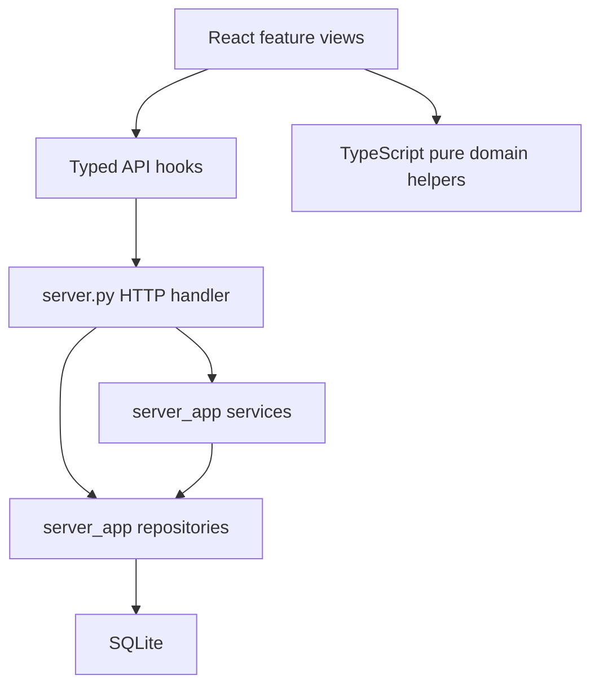

# CageLedger 项目拆分概览

## 改造方向

在保持 API、SQLite、业务规则、权限、UI 和导出结果兼容的前提下，将现有聚合文件拆为领域内分层模块，并建立可持续的架构门禁。

## 当前架构



前端已有无循环的单向依赖和页面懒加载。后端已有 service/repository 雏形，`server.py` 继续承载 schema、路由、鉴权、领域计算和兼容桥接。

## 技术栈

| 层   | 当前                                               | 目标                                                                      |
| ---- | -------------------------------------------------- | ------------------------------------------------------------------------- |
| 前端 | React 19、TypeScript、Vite、TanStack Query/Virtual | 技术栈保持，按 feature 拆分 view、hooks、components、model                |
| 后端 | Python 3.13 标准库 HTTP 服务                       | 标准库保持，按 domain 拆分 routes、service、repository、rules             |
| 数据 | SQLite WAL、幂等迁移                               | schema 与历史兼容保持，迁移按领域注册                                     |
| 样式 | 单一 `src/styles.css`                              | 固定顺序导入 tokens、base、shell、components、features、print、responsive |
| 部署 | Vite 构建、Python 静态服务、Docker、离线包         | 命令和制品格式保持                                                        |

## 主要入口

- 前端：`src/main.tsx`、`src/react/App.tsx`、`src/react/features/shell/ReactWorkspace.tsx`
- 后端：`server.py`、`CageLedgerHandler`
- 数据：`initialize_schema()`、`migrate_schema()`、`server_app/repositories/`
- 发布：`scripts/release_local.sh`、`.gitea/workflows/`

## 构建与验证

```bash
npm run check
npm run smoke:api
npm run test:e2e
npm run benchmark
npm run package:offline
```

权威环境为 Node 22.12、Python 3.13 和 ShellCheck。运行数据、测试数据库和构建产物保持在 Git 跟踪范围外。
