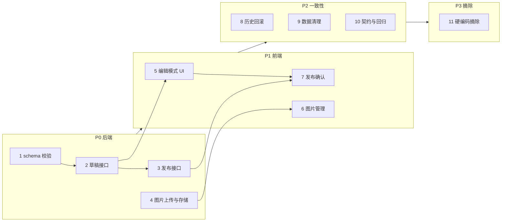

# Dependency Graph — 巡检标准在线编辑器

```mermaid
flowchart LR
  subgraph P0[P0 后端]
    T1[1 schema 校验] --> T2[2 草稿接口]
    T2 --> T3[3 发布接口]
    T4[4 图片上传与存储]
  end
  subgraph P1[P1 前端]
    T5[5 编辑模式 UI] --> T7[7 发布确认]
    T6[6 图片管理]
  end
  subgraph P2[P2 一致性]
    T8[8 历史回滚]
    T9[9 数据清理]
    T10[10 契约与回归]
  end
  subgraph P3[P3 摘除]
    T11[11 硬编码摘除]
  end
  P0 --> P1
  T2 --> T5
  T3 --> T7
  T4 --> T6
  P1 --> P2
  P2 --> P3
```
