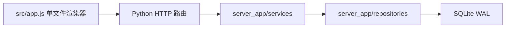
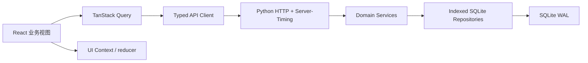

# React/Vite 性能升级项目概览

## 改造方向

将原生 JavaScript 单页应用一次性迁移到 React 19、Vite 8 和 TypeScript，取消纯静态数据模式，保持现有业务 API、SQLite 数据、界面和流程语义兼容。

## 改造前基线

- `src/app.js` 约 17,000 行，根节点 `innerHTML` 重建后重新绑定事件，约 194 个 `scheduleRender` 调用共享同一全局渲染入口。
- 初始前端资源约 1.15 MB；`jsQR` 约 257 KB 且当前启动时加载。
- 后端已有分页、15 秒内存缓存、WAL 和部分局部返回；列表热字段仍有 JSON 提取和临时排序。
- 当前数据库样本约 1.1 MB，无法代表 1 万笼位、10 万业务记录目标，需要独立临时基准库。

## 当前架构

| 层 | 改造前 | 当前 |
|:---|:-----|:-----|
| 前端语言 | JavaScript | TypeScript |
| UI | 字符串模板和全局事件绑定 | React 19 组件和局部更新 |
| 构建 | 浏览器直接加载源码 | Vite 8 哈希构建 |
| 服务端状态 | 手写全局状态和缓存 | TanStack Query |
| 大列表 | 完整 DOM | TanStack Virtual |
| 数据库 | SQLite WAL | SQLite WAL + 热字段和覆盖索引 |
| 部署 | Python 直接服务源码 | Python 服务 `web-dist` |

## 运行与验收

- 开发：`npm run dev`，Vite `5173` 代理 Python API。
- 生产构建：`npm run build`。
- 检查：`npm run check`。
- 性能基准：`npm run benchmark`，只使用系统临时目录中的生成数据库。
- 目标：交互 P95 `<100ms`、模块首开 P95 `<800ms`、列表 API P95 `<300ms`、登录可操作 P95 `<1.5s`。
