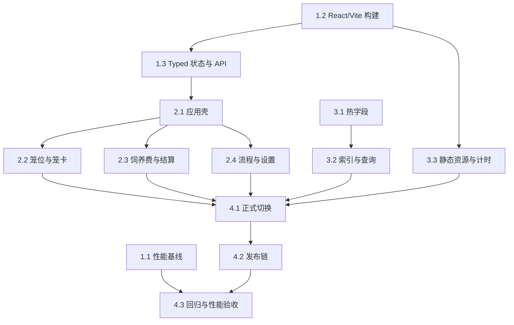

# React/Vite 性能升级依赖图

```mermaid
graph TD
    B["1.1 性能基线"]
    F["1.2 React/Vite 构建"] --> S["1.3 Typed 状态与 API"]
    S --> Shell["2.1 应用壳"]
    Shell --> Cage["2.2 笼位与笼卡"]
    Shell --> Billing["2.3 饲养费与结算"]
    Shell --> Admin["2.4 流程与设置"]
    DB["3.1 热字段"] --> Index["3.2 索引与查询"]
    F --> Static["3.3 静态资源与计时"]
    Cage --> Cut["4.1 正式切换"]
    Billing --> Cut
    Admin --> Cut
    Index --> Cut
    Static --> Cut
    Cut --> Release["4.2 发布链"]
    B --> Verify["4.3 回归与性能验收"]
    Release --> Verify
```
