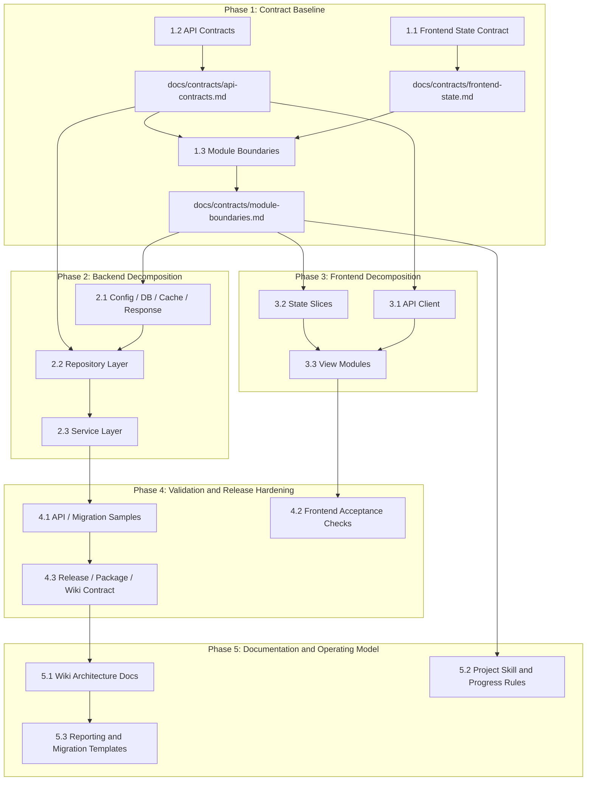

# Task Dependency Graph

## Lane Notes

| Phase | Parallel Lanes | Merge Risk |
|:------|:---------------|:-----------|
| Phase 2 | 2.1/2.3 in service lane, 2.2 in repository lane | Medium; both touch `server.py` during transition |
| Phase 3 | 3.1/3.3 in API/view lane, 3.2 in state lane | Medium; all call sites originate in `src/app.js` |
| Phase 4 | 4.1/4.3 in backend/release lane, 4.2 in frontend lane | Low after Phase 2/3 boundaries exist |
| Phase 5 | 5.1/5.3 in docs lane, 5.2 in process lane | Low |
