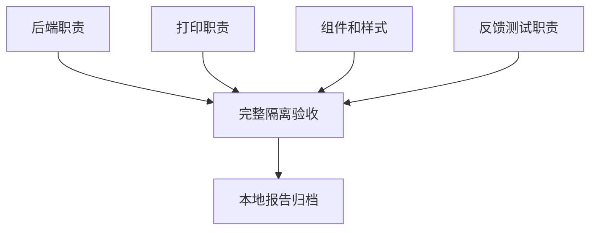

# 依赖与里程碑

```mermaid
graph TD
 B1[后端职责] --> B5[完整隔离验收]
 B2[打印职责] --> B5
 B3[组件和样式] --> B5
 B4[反馈测试职责] --> B5
 B5 --> Archive[本地报告归档]
```

每批实现后确认导入单向、接口兼容、规模无新增热点，再进入最终验收。独立只读review复核高风险边界；不介入其他开发/发布任务。
