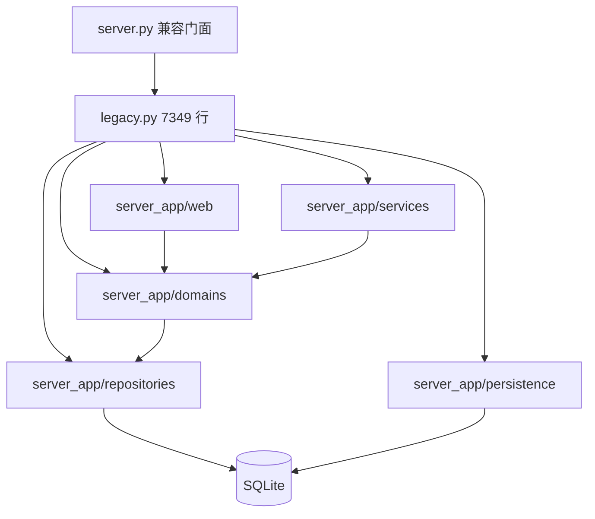

# `server_app/legacy.py` 持续拆分：项目概览

## 初步方向

采用渐进式替换策略，把 `server_app/legacy.py` 的剩余实现迁入现有 persistence、domain、service、repository 和 web 边界；保留 `server.py` 与历史导入符号的兼容行为。

## 当前架构

`server.py` 通过 `__getattr__` 在 `legacy` 和八个 domain 中解析历史符号。`legacy.py` 同时承担 schema、state 聚合、IACUC 同步、数量表、结算、流程、报销、HTTP handler 和运行时启动，当前 7349 行，架构门禁上限为 7350 行。

## 技术栈

| 层   | 当前                                   | 目标                                      |
| :--- | :------------------------------------- | :---------------------------------------- |
| 语言 | Python 3.13                            | Python 3.13                               |
| HTTP | 标准库 `ThreadingHTTPServer`           | 薄 application handler + 按域 web handler |
| 业务 | `legacy.py` 与 `domains/services` 混合 | domain/service 单一 owner                 |
| 数据 | SQLite WAL                             | repository/persistence 显式边界           |
| 兼容 | `server.py.__getattr__`                | 显式 re-export 清单                       |
| 部署 | Python 服务统一托管 API 与前端         | 保持现状                                  |

## 入口和边界

- 进程入口：`server.py` → `server_app.legacy.main()`。
- HTTP 入口：`CageLedgerHandler` 的 `do_GET/POST/PUT/DELETE`，约 1992 行。
- 路由端口：`server_app/web/router.py`、`route_matchers.py` 和现有按域 handler。
- 业务边界：`server_app/domains/`。
- 数据访问：`server_app/repositories/`；部分 `domains/*/repository.py` 是兼容 re-export。
- schema：`server_app/persistence/`，`legacy.initialize_schema` 仍是测试与脚本兼容入口。

## 构建与验证

- 架构：`npm run check:architecture -- --enforce`
- Python：`npm run test:python`
- 基础门禁：`npm run check`
- API：`npm run smoke:api`
- 完整验证：`npm run verify:full`
- 补丁检查：`git diff --check`

## 外部集成

- SQLite 数据库与文件附件目录由环境变量配置。
- PDF 渲染、缓存和预热在结算写入后执行。
- IACUC 索引、Gitea 更新检查和 DeepSeek 解析属于现有外部边界。
- 追踪模式为 `LOCAL_ONLY`：正式远端是私有 Gitea，当前环境未提供 `gh` CLI。
