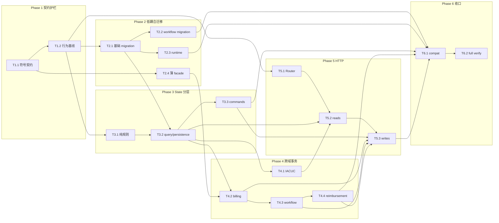

# `server_app/legacy.py` 持续拆分：依赖图

```mermaid
flowchart LR
  subgraph P1[Phase 1 契约护栏]
    T11[T1.1 符号契约] --> T12[T1.2 行为基线]
  end
  subgraph P2[Phase 2 低耦合迁移]
    T21[T2.1 基础 migration] --> T22[T2.2 workflow migration]
    T23[T2.3 runtime]
    T24[T2.4 薄 facade]
  end
  subgraph P3[Phase 3 State 分层]
    T31[T3.1 纯规则] --> T32[T3.2 query/persistence] --> T33[T3.3 commands]
  end
  subgraph P4[Phase 4 跨域事务]
    T41[T4.1 IACUC]
    T42[T4.2 billing] --> T43[T4.3 workflow] --> T44[T4.4 reimbursement]
  end
  subgraph P5[Phase 5 HTTP]
    T51[T5.1 Router] --> T52[T5.2 reads] --> T53[T5.3 writes]
  end
  subgraph P6[Phase 6 收口]
    T61[T6.1 compat] --> T62[T6.2 full verify]
  end

  T12 --> T21
  T21 --> T23
  T11 --> T24
  T12 --> T31
  T21 --> T32
  T32 --> T41
  T24 --> T42
  T32 --> T42
  T12 --> T51
  T32 --> T52
  T41 --> T52
  T33 --> T53
  T42 --> T53
  T43 --> T53
  T44 --> T53
  T22 --> T61
  T23 --> T61
  T33 --> T61
  T44 --> T61
  T53 --> T61
```

可并行窗口：T2.1、T2.4；T2.3 在 T2.1 后可与 T2.2 并行；T3.1 与 T2.1/T2.4 可在隔离工作树执行。跨域事务 T4.2→T4.3→T4.4 保持串行。
