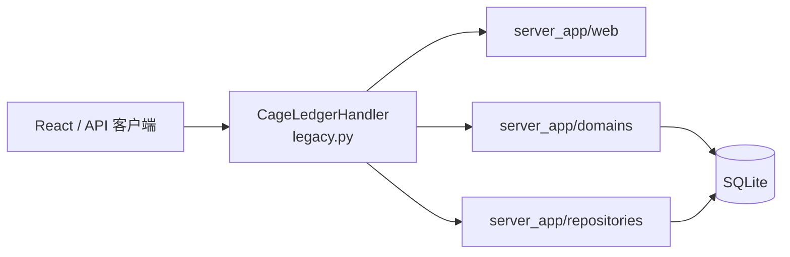

# legacy.py 尺寸治理：项目概览

## 初步方向

将 `server_app/legacy.py` 从聚合兼容层逐步拆为领域实现与 Web 适配层；首个切片恢复 7,100 行架构门禁，同时保持 API、权限、SQLite 和上传行为兼容。

## 当前架构

`server.py` 以 `server_app.legacy` 作为兼容入口；`legacy.py` 当前同时承担 schema 初始化、状态兼容、数量与结算编排、multipart 解析和 HTTP 路由。现有 `server_app/web/` 已容纳路由器、PDF、月度汇总等 Web 适配能力。

## 技术基线

| 层       | 当前实现                               | 本轮目标                                     |
| :------- | :------------------------------------- | :------------------------------------------- |
| HTTP     | Python 标准库 `BaseHTTPRequestHandler` | 将无业务依赖的请求解析迁至 `server_app/web/` |
| 兼容入口 | `server_app/legacy.py`                 | 继续保留稳定导出与 `CageLedgerHandler`       |
| 领域     | `server_app/domains/`                  | 保持现有业务服务边界                         |
| 持久化   | SQLite + repositories                  | 保持 SQL、迁移与数据格式                     |

## 入口与验证

- 服务入口：`server.py`、`server_app/legacy.py:main()`。
- 架构门禁：`scripts/check_architecture.mjs`，当前将 `legacy.py` 计为 7,106 行，硬限制 7,100 行。
- 验证：`npm run check`、`npm run smoke:api`，以及上传相关 API 回归。

## 外部集成

- SQLite、IACUC 索引文件、PDF 导出与浏览器 multipart 上传。
- 本轮只移动请求体解析，不改变数据库、配置、HTTP 路径或响应契约。
