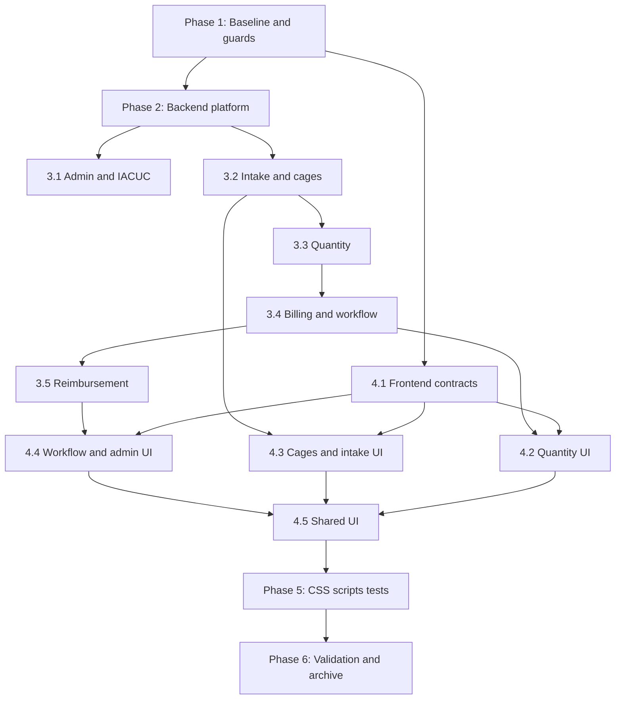

# CageLedger 拆分依赖图

```mermaid
graph TD
    P1[Phase 1: Baseline and guards] --> P2[Phase 2: Backend platform]
    P1 --> F41[4.1 Frontend contracts]
    P2 --> B31[3.1 Admin and IACUC]
    P2 --> B32[3.2 Intake and cages]
    B32 --> B33[3.3 Quantity]
    B33 --> B34[3.4 Billing and workflow]
    B34 --> B35[3.5 Reimbursement]
    F41 --> F43[4.3 Cages and intake UI]
    B32 --> F43
    F41 --> F42[4.2 Quantity UI]
    B34 --> F42
    F41 --> F44[4.4 Workflow and admin UI]
    B35 --> F44
    F42 --> F45[4.5 Shared UI]
    F43 --> F45
    F44 --> F45
    F45 --> P5[Phase 5: CSS scripts tests]
    P5 --> P6[Phase 6: Validation and archive]
```
