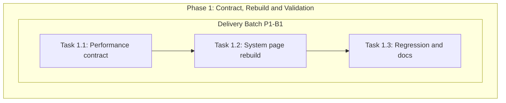

# Task Dependency Graph

```mermaid
graph LR
  subgraph Phase1 [Phase 1: Contract, Rebuild and Validation]
    subgraph P1B1 [Delivery Batch P1-B1]
      T11[Task 1.1: Performance contract]
      T12[Task 1.2: System page rebuild]
      T13[Task 1.3: Regression and docs]
      T11 --> T12 --> T13
    end
  end
```
