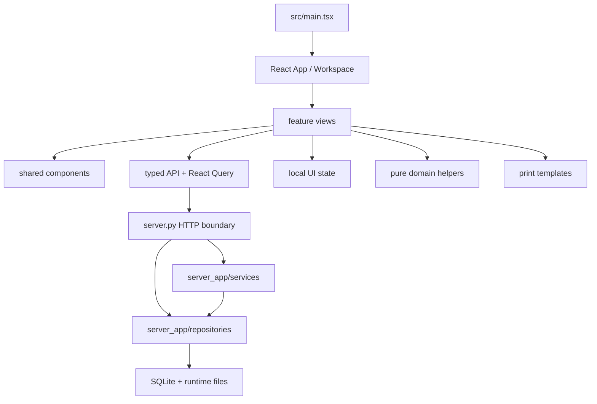

# CageLedger 模块边界

本契约描述 React 迁移完成后的代码结构。新增功能沿现有边界扩展，迁移过程记录保留在 `docs/archives/cageledger-react-performance/`。

## 依赖方向

依赖保持单向。`src/domain/`、repository 和 service 层不导入页面组件。

## 前端边界

| 路径                           | 责任                                      | 可以依赖                             | 禁止承担                        |
| ------------------------------ | ----------------------------------------- | ------------------------------------ | ------------------------------- |
| `src/main.tsx`                 | React 根节点、QueryClient、UiProvider     | `src/react/App.tsx`、Provider        | 页面业务和 API 请求             |
| `src/react/App.tsx`            | 会话门禁、公开扫码路由、应用入口状态      | session hook、workspace              | 业务页面实现                    |
| `src/react/features/shell/`    | 导航、权限可见性、页面懒加载              | features、UI state                   | 数据库和业务计算                |
| `src/react/features/<domain>/` | 页面编排、表单草稿、交互和业务动作        | API hooks、domain、components、print | 自建全局缓存和直接 SQL 语义     |
| `src/react/components/`        | 跨页面通用组件                            | React、样式类、通用类型              | 业务域专属请求                  |
| `src/react/api/`               | 请求客户端、契约类型、查询键、Query hooks | `fetch`、TanStack Query              | DOM、页面布局和打印             |
| `src/react/state/`             | 当前工作区、导航折叠、界面偏好            | React reducer、localStorage          | 服务端业务数据                  |
| `src/domain/`                  | 可测试的纯业务函数                        | TypeScript 标准能力                  | React、DOM、网络和 localStorage |
| `src/react/print/`             | 打印 HTML、二维码和文档版式               | domain 类型、模板工具                | 页面状态和服务端写入            |
| `src/styles.css`               | 全局 token、布局、组件状态和响应式        | CSS 自定义属性                       | 业务条件判断                    |

## 后端边界

| 路径                       | 责任                                                         | 约束                                     |
| -------------------------- | ------------------------------------------------------------ | ---------------------------------------- |
| `server.py`                | HTTP 路由、Cookie Session、输入解析、状态码、schema 兼容入口 | handler 保持短小，新业务编排下沉 service |
| `server_app/config.py`     | 环境变量、路径、系统元数据                                   | 配置读取集中管理                         |
| `server_app/http.py`       | JSON、gzip、缓存头和计时响应                                 | 统一响应行为                             |
| `server_app/static.py`     | `web-dist/` 静态资源、ETag、gzip 和 SPA fallback             | 只处理前端传输                           |
| `server_app/db.py`         | SQLite 连接辅助                                              | 连接参数和事务入口一致                   |
| `server_app/cache.py`      | 15 秒短缓存和失效辅助                                        | key 包含 scope、filter 和 actor          |
| `server_app/repositories/` | SQL、分页、结构化列、payload 兼容、行级读写                  | 返回可序列化 dict/list，不承载 HTTP      |
| `server_app/services/`     | 接收、入驻、统计表转移、结算和报销事务                       | 聚合 repository、校验业务、生成审计结果  |

## 服务端数据与本地状态

- SQLite 是笼卡、笼位、统计表、结算和报销数据的 source of truth。
- TanStack Query 管理服务端状态、分页缓存和请求生命周期。
- `src/react/state/` 管理当前页面与导航显示偏好。
- 页面组件管理短生命周期表单草稿、焦点和弹窗状态。
- localStorage 只持久化 `cageledger.ui.v2`，并清理旧 `cageledger.v1`、`lahcas.v1` 业务缓存。

## 功能落点

| 需求             | 首选改动位置                                                        |
| ---------------- | ------------------------------------------------------------------- |
| 新增业务页面     | `src/react/features/<domain>/`，并在 shell 中懒加载                 |
| 新增 API         | `server.py` 路由 + service/repository + `src/react/api/` typed hook |
| 新增纯计算规则   | `src/domain/`，同步单元测试                                         |
| 新增打印格式     | `src/react/print/`，预览和打印共享模板                              |
| 新增列表筛选     | repository 结构化查询 + API 参数 + Query key                        |
| 新增本地显示偏好 | `src/react/state/ui.tsx` 与 `uiStorage.ts`                          |
| 新增颜色或状态   | `src/styles.css :root` + `ui-color-system.md`                       |
| 修改正式用户流程 | 对应 `wiki/` 页面                                                   |

## 跨边界改动清单

新增写入链路需要同时明确：

1. API 请求和响应结构。
2. 权限规则。
3. service 事务边界。
4. repository 结构化列和旧 payload 兼容。
5. 服务端缓存失效范围。
6. React Query 查询键失效范围。
7. 审计事件。
8. 自动迁移与旧库回填。
9. 单元、API 和浏览器验证。

## 当前技术债边界

- `server.py` 继续保留 schema 初始化、路由和兼容桥接，新增领域逻辑优先进入 `server_app/`。
- `src/styles.css` 是共享全局样式，新增规则使用业务前缀并复用语义 token。
- `src/react/api/contracts.ts` 覆盖当前高频契约；新增接口同步补齐类型，逐步减少 `Record<string, unknown>`。
- `ENTITY_ENDPOINTS` 保留旧通用实体接口；新高频流程优先使用专用 service endpoint。

## 验收标准

- 页面组件通过 typed API hooks 获取服务端数据。
- 服务端业务写入具备明确的 service/repository 归属。
- 服务端写入返回足够的局部刷新数据。
- Query key 和缓存失效与写入范围一致。
- 纯计算具有单元测试，关键流程具有浏览器或 API 回归。
- 接口、部署、权限和用户流程变化同步更新 `wiki/`。

代码格式、lint 和依赖规则见 `code-quality.md`，分层验证规则见 `testing-strategy.md`。
