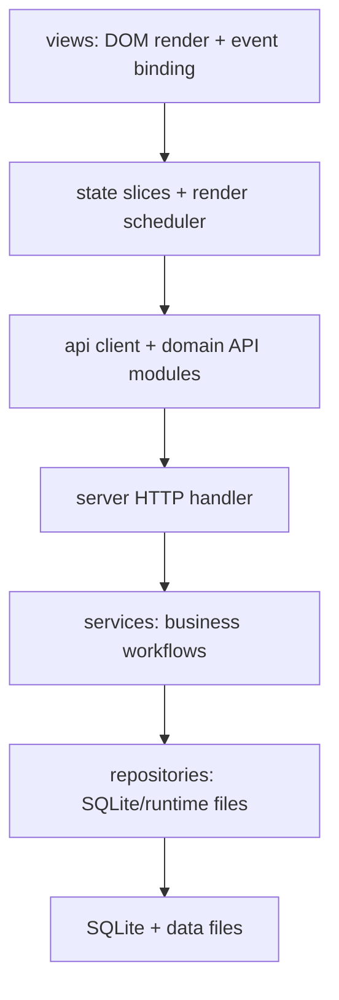

# 模块边界与迁移顺序

> Scope: Phase 1 / Task 1.3
> Target: 渐进拆分，保持 CageLedger 当前业务语义和发布链稳定

## 目标分层

## 前端目标目录

| Directory | Responsibility | First Migration Candidates |
|:----------|:---------------|:---------------------------|
| `src/api/` | fetch wrapper and domain API modules | `client.js`, `bootstrap.js`, `intake.js`, `billing.js` |
| `src/state/` | state slices, local merge helpers, render scheduling | `session.js`, `infrastructure.js`, `intake.js`, `billing.js` |
| `src/domain/` | pure business helpers | dates, IACUC normalization, intake parsing, billing math |
| `src/views/` | page renderers and event wiring | about/system, intake list, placement tasks, workflow center |
| `src/print/` | print/PDF/export HTML builders | cage cards, billing statement |

## 后端目标目录

| Directory | Responsibility | First Migration Candidates |
|:----------|:---------------|:---------------------------|
| `server_app/config.py` | env, paths, constants | Completed in Task 2.1 |
| `server_app/http.py` | response headers and JSON response helpers | Completed in Task 2.1 |
| `server_app/db.py` | connection and schema initializer guard | Completed in Task 2.1 |
| `server_app/cache.py` | short TTL cache and performance logging | Completed in Task 2.1 |
| `server_app/repositories/` | table-specific SQLite access | rooms/racks/slots/occupancies/intake/quantity/billing/workflows |
| `server_app/services/` | domain workflows | intake receipt, placement move-in, quantity transfer sync, billing workflow |
| `server_app/contracts/` | serializable shape helpers | response builders, validation helpers |

## 迁移顺序

1. 固定契约：以 `docs/contracts/frontend-state.md` 和 `docs/contracts/api-contracts.md` 作为 Phase 2/3 入口。
2. 后端先抽基础设施：config/db/cache/response helpers，保持 `server.py` 作为兼容入口。
3. 后端再抽 repository：从低风险基础表开始，再进入 intake、placement、quantity、billing。
4. 后端最后抽 service：确认接收、待进驻、数量统计表转移、结算流程推进。
5. 前端先抽 API client：所有 fetch 归口，错误、401、JSON parse 统一。
6. 前端再抽 state slices：按本轮状态契约做局部合并和失效。
7. 前端最后抽 view modules：按页面迁移，主入口只保留 app shell 和装配。
8. 验证与发布硬化：补关键路径回归样本、页面验收清单、release/package/wiki sync contract。

## 回滚边界

| Migration Unit | Rollback Rule |
|:---------------|:--------------|
| one backend helper module | revert module import and keep original `server.py` function |
| one repository family | route/service returns must match pre-migration JSON shape |
| one service workflow | retain old function behind same handler until new service passes manual path |
| one frontend API module | call sites can switch back to old fetch helper with same response shape |
| one state slice | render output and local merge behavior must match previous page interaction |
| one view module | DOM class contract stays compatible with `src/styles.css` |

## 命名规则

| Type | Rule |
|:-----|:-----|
| API modules | noun domain, e.g. `intakeApi`, `billingApi` |
| State helpers | verb + domain, e.g. `mergePlacementTasks`, `invalidateBillingContext` |
| Services | action-oriented, e.g. `confirm_intake_receipt`, `advance_billing_workflow` |
| Repositories | table/domain noun, e.g. `quantity_sheet_repository.py` |
| Contracts | response noun, e.g. `quantity_sheet_save_response` |

## 验收标准

- 每个迁移 PR 只跨一个明确边界。
- 每个新模块有单一责任和可序列化输入输出。
- 每个写入路径说明缓存失效点和前端局部合并策略。
- 每轮改动通过 `npm run check`。
- 涉及接口、部署、数据结构或用户操作时，同步更新 `wiki/`。

## 当前迁移进度

| Phase | Completed |
|:------|:----------|
| Task 2.1 | `server_app/config.py`, `server_app/db.py`, `server_app/cache.py`, `server_app/http.py` |
| Task 2.2 partial | `server_app/repositories/payload.py`, `server_app/repositories/infrastructure.py`, `server_app/repositories/users.py`, `server_app/repositories/audit.py`, `server_app/repositories/iacuc.py`, `server_app/repositories/entities.py`, `server_app/repositories/state.py`, `server_app/repositories/billing.py` |
