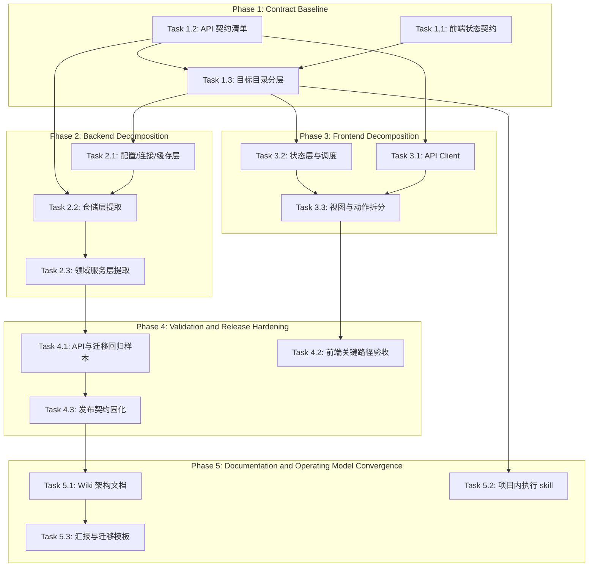

# Task Dependency Graph

```mermaid
graph TD
    subgraph Phase1["Phase 1: Contract Baseline"]
        T11["Task 1.1: 前端状态契约"]
        T12["Task 1.2: API 契约清单"]
        T13["Task 1.3: 目标目录分层"]
        T11 --> T13
        T12 --> T13
    end

    subgraph Phase2["Phase 2: Backend Decomposition"]
        T21["Task 2.1: 配置/连接/缓存层"]
        T22["Task 2.2: 仓储层提取"]
        T23["Task 2.3: 领域服务层提取"]
        T21 --> T22
        T22 --> T23
    end

    subgraph Phase3["Phase 3: Frontend Decomposition"]
        T31["Task 3.1: API Client"]
        T32["Task 3.2: 状态层与调度"]
        T33["Task 3.3: 视图与动作拆分"]
        T31 --> T33
        T32 --> T33
    end

    subgraph Phase4["Phase 4: Validation and Release Hardening"]
        T41["Task 4.1: API与迁移回归样本"]
        T42["Task 4.2: 前端关键路径验收"]
        T43["Task 4.3: 发布契约固化"]
        T41 --> T43
    end

    subgraph Phase5["Phase 5: Documentation and Operating Model Convergence"]
        T51["Task 5.1: Wiki 架构文档"]
        T52["Task 5.2: 项目内执行 skill"]
        T53["Task 5.3: 汇报与迁移模板"]
        T51 --> T53
    end

    T13 --> T21
    T13 --> T32
    T12 --> T22
    T12 --> T31
    T23 --> T41
    T33 --> T42
    T43 --> T51
    T13 --> T52
```
