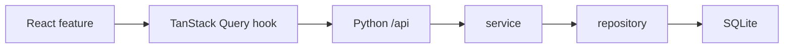

# API 与数据模型

本页提供 API 和数据模型概览。完整工程契约见 `docs/contracts/api-contracts.md`，前端类型源位于 `src/react/api/contracts.ts`。

## 架构链路

开发模式由 Vite 将 `/api` 代理到 `5174`。生产模式由 Python 在 `5173` 同时提供 `web-dist/` 和 API。

## 通用响应

| 类型     | 形状                                                                 |
| -------- | -------------------------------------------------------------------- |
| 错误     | `{ "error": "message" }`                                             |
| 分页     | `{ "items": [], "page": { "limit", "offset", "total", "hasMore" } }` |
| 单对象   | `{ "item": {} }`                                                     |
| 会话     | `{ "user": {} }`                                                     |
| 流程详情 | 命名字段组合，例如 `workflow`、`versions`、`events`                  |

认证使用 HttpOnly Cookie Session。`admin` 具备全局管理权限，`room_admin` 按房间授权和具体业务入口校验。

## API 家族

### 会话和公开查询

| 方法   | 路径                                     | 用途                          |
| ------ | ---------------------------------------- | ----------------------------- |
| `GET`  | `/api/health`                            | 服务、数据库、版本和 revision |
| `GET`  | `/api/system/info`                       | 系统元数据                    |
| `POST` | `/api/auth/login`                        | 登录                          |
| `POST` | `/api/auth/logout`                       | 退出                          |
| `GET`  | `/api/auth/me`                           | 当前会话                      |
| `GET`  | `/api/public/cage-card/{animalRecordId}` | 免登录笼卡查询                |

### 设施和笼位

| 方法           | 路径                                   | 用途                           |
| -------------- | -------------------------------------- | ------------------------------ |
| `GET`          | `/api/bootstrap?scope=summary`         | 首页摘要                       |
| `GET`          | `/api/bootstrap?scope=room&roomId=...` | 单房间笼架、笼位、占用和待进驻 |
| `GET`          | `/api/bootstrap?scope=full`            | 兼容全量状态                   |
| `POST`         | `/api/infrastructure`                  | 房间、笼架和笼位增量维护       |
| `POST` / `PUT` | `/api/occupancies[/{id}]`              | 占用写入                       |
| `GET`          | `/api/infrastructure/occupancies`      | 月度结算定向占用               |

### 笼卡和待进驻

| 方法             | 路径                                       | 用途                     |
| ---------------- | ------------------------------------------ | ------------------------ |
| `GET` / `POST`   | `/api/intake-batches`                      | 分页查询或新建批次       |
| `PUT` / `DELETE` | `/api/intake-batches/{id}`                 | 编辑或删除批次           |
| `POST`           | `/api/intake-batches/{id}/confirm-receipt` | 确认接收并生成待进驻任务 |
| `GET`            | `/api/placement-tasks`                     | 分页查询待进驻任务       |
| `POST`           | `/api/placement-tasks/{id}/reserve`        | 预留笼位                 |
| `POST`           | `/api/placement-tasks/{id}/move-in`        | 正式入驻                 |
| `POST`           | `/api/placement-tasks/{id}/reassign-room`  | 变更目标房间             |

### 数量统计表和结算

| 方法                     | 路径                                     | 用途                 |
| ------------------------ | ---------------------------------------- | -------------------- |
| `GET`                    | `/api/quantity-sheet-rooms`              | 统计表跨房间录入候选 |
| `GET` / `POST`           | `/api/quantity-sheets`                   | 分页查询或新建统计表 |
| `GET` / `PUT` / `DELETE` | `/api/quantity-sheets/{id}`              | 详情、编辑和删除     |
| `POST`                   | `/api/billing-statements/generate`       | 动态笼位图结算       |
| `POST`                   | `/api/billing-statements/generate-by-pi` | 按 PI 汇总结算       |
| `GET`                    | `/api/billing-statements/{id}`           | 单张结算单           |

### 流程和报销

| 方法                     | 路径                                        | 用途                 |
| ------------------------ | ------------------------------------------- | -------------------- |
| `GET`                    | `/api/billing-workflows`                    | 结算流程列表         |
| `GET`                    | `/api/billing-workflows/{id}`               | 流程、版本和事件     |
| `GET`                    | `/api/billing-workflows/{id}/lines`         | 指定版本逐日明细     |
| `POST`                   | `/api/billing-workflows/advance`            | 推进流程             |
| `GET`                    | `/api/reimbursement-records`                | 报销台账列表         |
| `GET` / `PUT` / `DELETE` | `/api/reimbursement-records/{id}`           | 台账详情、登记和删除 |
| `POST`                   | `/api/reimbursement-records/import-monthly` | 导入历史月汇总 Excel |
| `POST`                   | `/api/reimbursement-records/import-arrears` | 导入历史欠缴 Excel   |

### 管理

| 方法             | 路径                                 | 用途                   |
| ---------------- | ------------------------------------ | ---------------------- |
| `GET` / `POST`   | `/api/users`                         | 账号查询和创建         |
| `PUT` / `DELETE` | `/api/users/{id}`                    | 账号维护               |
| `GET`            | `/api/iacuc-index`                   | 完整项目索引           |
| `GET`            | `/api/iacuc-index/status`            | 索引状态               |
| `POST`           | `/api/iacuc-index/upload`            | CSV 上传和派生数据同步 |
| `GET` / `PUT`    | `/api/principal-identities[/{name}]` | PI 身份与减免配置      |
| `GET`            | `/api/audit-events`                  | 分页审计日志           |
| `GET`            | `/api/system/update-check`           | Gitea Release 更新检查 |

## 核心数据对象

| 对象                      | 业务键                   | 说明                               |
| ------------------------- | ------------------------ | ---------------------------------- |
| `experiment_applications` | IACUC                    | 项目、PI、实验负责人、来源和有效期 |
| `intake_batches`          | batch id                 | 接收批次和打印卡集合               |
| `cards`                   | Animal Record ID         | 单张笼卡的持久唯一身份             |
| `placement_tasks`         | task id                  | 接收后到正式入驻的任务             |
| `occupancies`             | occupancy id + slot id   | 笼位占用历史                       |
| `quantity_sheets`         | month + IACUC + sheet id | 月度人工数量记录                   |
| `billing_statements`      | statement/version id     | 月度结算结果                       |
| `billing_workflows`       | workflow id              | 结算单状态和版本链                 |
| `reimbursement_records`   | month + PI               | 应缴、已缴、未缴和报销状态         |
| `audit_events`            | event id                 | 关键写操作审计                     |

SQLite 同时保留结构化热字段和兼容 payload。启动迁移会补字段、索引和必要回填。

## 前端缓存

- API hooks 位于 `src/react/api/`。
- 查询键位于 `queryKeys.ts`。
- 默认 staleTime 15 秒，gcTime 5 分钟。
- mutation 根据写入范围失效当前房间、当前列表或台账根键。
- localStorage 只保存界面偏好。

## 相关页面

- [[项目结构]]
- [[数据管理与IACUC索引]]
- [[饲养费核算]]
- [[开发规范]]
