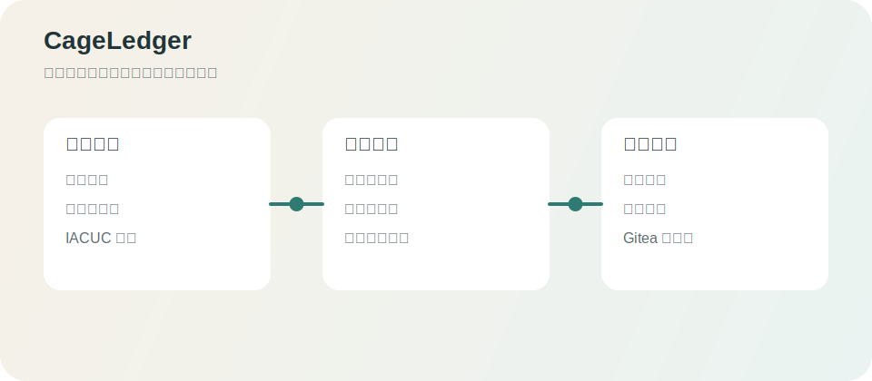

# CageLedger Wiki

CageLedger 是实验动物中心的笼卡、笼位、饲养费结算和报销台账系统。`wiki/` 是正式文档源，`main` 分支中的变更会同步到 Gitea Wiki。

## 阅读路径

### 使用者

1. [[快速开始]]
2. [[用户操作手册]]
3. [[笼卡管理]]
4. [[笼位与房间管理]]
5. [[饲养费核算]]
6. [[常见问题]]

### 管理员

1. [[部署与运行]]
2. [[系统配置]]
3. [[账号与权限]]
4. [[数据管理与IACUC索引]]
5. [[备份与维护]]
6. [[故障排查]]

### 开发维护者

1. [[项目结构]]
2. [[API与数据模型]]
3. [[开发规范]]
4. [[发布与CI-CD]]

## 核心业务链

| 业务链     | 入口                                        | 结果                                  |
| ---------- | ------------------------------------------- | ------------------------------------- |
| 接收与入驻 | 笼卡管理 -> 打印/接收 -> 待进驻 -> 笼位管理 | 笼卡实例、Animal Record ID 和占用记录 |
| 占用与结算 | 动态笼位图 / 数量统计表 -> PI 汇总结算      | 数量统计表、逐日明细和月度结算单      |
| 结算与报销 | 发起流程 -> 流程中心 -> 报销登记            | 结算版本、报销台账和累计未缴          |

## 当前技术架构

- 前端：React 19、TypeScript、Vite、TanStack Query、TanStack Virtual
- 后端：Python 标准库 HTTP 服务，service/repository 分层
- 数据库：SQLite，WAL 模式
- 生产页面：Vite 构建到 `web-dist/`，由 Python 服务提供
- 测试：Vitest、Testing Library、Playwright、Python unittest
- 部署：Gitea 容器镜像、Docker Compose、离线包

## 固定入口

- 本地页面：`http://localhost:5173`
- 正式仓库：`https://git.cellnucle.us/hugo/cageledger`
- 正式镜像：`git.cellnucle.us/hugo/cageledger:<tag>`
- 工程契约：`docs/contracts/`
- 迁移归档：`docs/archives/`
