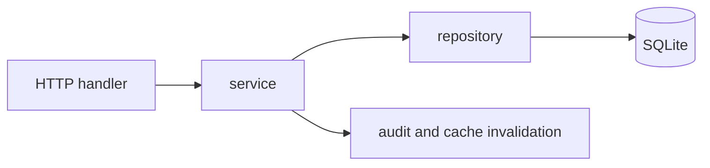

# 后端架构

后端使用 Python 标准库 HTTP 服务和 SQLite。请求处理、业务事务与 SQL 访问保持分层，旧 payload 和历史数据库通过兼容迁移持续可读。

## 分层结构

| 层级            | 主要路径                                               | 责任                                         |
| --------------- | ------------------------------------------------------ | -------------------------------------------- |
| HTTP 与兼容入口 | `server.py`、`server_app/legacy.py`、`server_app/web/` | 鉴权、参数解析、路由、状态码与响应           |
| 业务服务        | `server_app/services/`、`server_app/domains/`          | 校验、跨表事务、审计与缓存失效               |
| 数据访问        | `server_app/repositories/`                             | SQL、分页、索引、结构化热字段与 payload 兼容 |
| 配置与静态资源  | `server_app/config.py`、`server_app/static.py`         | 环境变量、应用、文档和静态文件               |

## 数据库原则

- SQLite 启用 WAL，运行数据默认位于 `data/cageledger.sqlite`。
- schema 迁移保持幂等，启动时补充字段、索引和必要回填。
- 列表读取使用服务端分页、筛选与稳定排序；热点字段保存在实体列以避免 JSON 全表扫描。
- 结算、权限、转移和流程推进会写入审计事件。

## PDF 与附件

服务端生成 PDF，缓存目录默认位于数据库同级 `pdf-cache/`。巡检和报销附件保存在受鉴权的运行目录，通过 API 下载。生产镜像预装 Chromium 与中文字体，PDF 任务复用常驻浏览器进程。

接口契约详见 [API 与数据模型](/development/api-and-data-model)。
