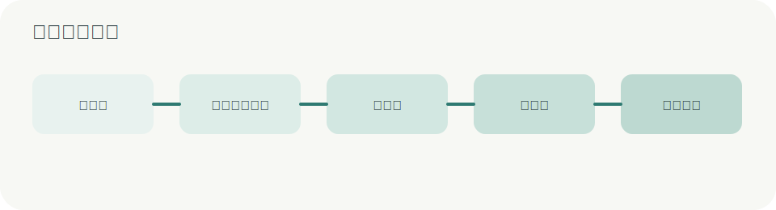

# 饲养费核算

本页覆盖两条结算入口、关键计费规则和流程中心联动。

## 两条数据入口

| 入口 | 数据来源 | 适用场景 |
| --- | --- | --- |
| 动态笼位图 | 占用记录 | 房间占用维护完整，希望自动按时间线结算 |
| 数量统计表 | 人工录入统计表 | 纸质台账仍在使用或过渡期核对 |

## 关键规则

- IACUC 是结算链路的核心业务键
- `项目来源` 是 `funding` 的 source of truth
- 同一项目负责人名下可汇总多个 IACUC
- 数量统计表支持纸质表左右双栏录入，按手动选择的日期自动滚动计算结余
- 数量统计表支持伦理号之间转入转出
- 结算流程属于月度结算单，不属于单个笼位生命周期

## 典型结算步骤

### 动态笼位图

1. 选择月份
2. 选择项目负责人
3. 生成结算预览
4. 导出 PDF / CSV 或发起流程

### 数量统计表

1. 选择月份
2. 选择 IACUC
3. 新建或编辑数量统计表
4. 保存
5. 导出 PDF / CSV 或发起流程

### 数量统计表录入规则

- 明细区固定为左右两栏，每栏 15 行，字段与纸质《实验动物数量统计表》一致，日期可手动输入。
- 左侧第一行固定为当前统计表月份 1 号，仍可录入新增和减少；结余总数和结余笼数必填，默认 0；顶部不再单独维护月初结余。
- 日期支持 `2026/05/15`、`20260515`、`0515`；只输入日号如 `15` 时，系统按当前统计表月份补全年月。
- 同一伦理同月可以新增统计表页，每页提供 30 个录入槽位。
- 新增和减少可直接录入数量，也可用类型下拉框标记购入、转入、分笼、取材、死亡和转出。
- 只录入新增或减少时，系统从月初结余开始自动计算后续日期的结余总数和结余笼数。
- 只录入某日结余时，系统按上一日结余反推当日新增或减少。
- 未填写的行跳过；未录入日期自动沿用上一条有效日期行的结余，保存时只保留有日期且有变更、有人工结余或有经手人的行。

## 流程状态

```text
in_feeding
statement_generated
statement_sent
statement_signed_returned
submitted_to_finance
```



## 输出结果

- 饲养明细 CSV
- 结算单 PDF
- 流程中心中的版本记录和状态事件

## 相关页面

- [[用户操作手册]]
- [[API与数据模型]]
